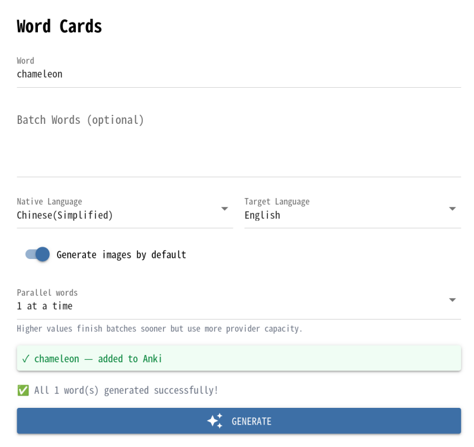
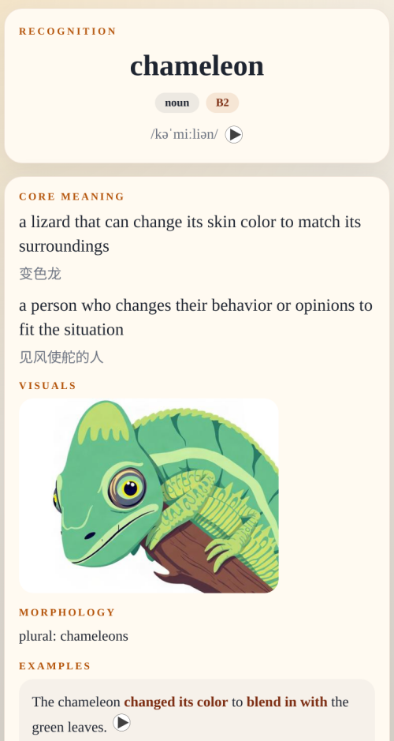

# AnkiNote

<p align="center">
  
</p>

<p align="center">
  <a href="https://pypi.org/project/ankinote-ai/"></a>
  <a href="https://pypi.org/project/ankinote-ai/"></a>
  <a href="https://github.com/ignity21/ankinote-ai/blob/main/LICENSE"></a>
  <a href="https://codecov.io/gh/ignity21/ankinote-ai"></a>
</p>

> AI-powered Anki card generator — vocabulary, phrases, sentences, and STEM concepts

## 📖 About

AnkiNote is an automated Anki flashcard generator that uses litellm to support a wide range of AI providers — Gemini, GPT, Claude, DeepSeek, and more — for generating definitions, examples, mnemonics, and images, then syncs directly with Anki through AnkiConnect.

## ✨ Features

- 🖥️ **Web UI** - Configure AI providers, models, and API keys visually in the
  browser — no `.env` file or restart needed
- 🔌 **Two Anki Backends** - `connect` mode plugs into a local Anki Desktop
  for quick trials; the in-process `collection` (headless) backend runs
  standalone as a long-lived service, syncing directly with AnkiWeb — no Anki
  app required
- 🤖 **Multi-Provider AI** - Powered by litellm, supporting Gemini, GPT, Claude, DeepSeek, and more for text and image generation
- 🔊 **Audio Generation** - Text-to-Speech using Google Cloud TTS API
- 🖼️ **AI Image Generation** - Automatic image generation via Google AI (Gemini)
- 🔄 **Direct Anki Sync** - Seamless integration with Anki through AnkiConnect plugin
- 📝 **Dual-Direction Cards** - Supports both word→definition and definition→word learning modes
- 🎨 **Beautiful Templates** - Built-in Light/Dark mode responsive card templates
- ⚡ **Batch Processing** - Generate multiple cards from word lists efficiently
- 🌐 **Multi-Language** - Japanese, English (US), and extensible for more languages
- 🧮 **STEM Concepts** - Math, science, and programming concept cards with MathJax rendering

## 🚀 Quick Start

### Prerequisites

- Python 3.14+
- [uv](https://github.com/astral-sh/uv) package manager
- Anki with [AnkiConnect](https://ankiweb.net/shared/info/2055492159) plugin installed, **or** the in-process (headless) backend — see below

### Installation

```bash
# Install from PyPI
uv pip install ankinote-ai

# Or install the CLI/GUI as an isolated uv tool
uv tool install ankinote-ai
```

AnkiNote has two front ends that share the same card-generation engine:

- **Web UI** (`ankinote-gui`) — AI provider keys and app settings are
  configured from the browser, no `.env` file needed for those. A handful of
  process-level settings (Anki backend, ports, secrets — see
  [below](#what-still-needs-to-be-set-outside-the-browser)) are still env
  vars. Start here if you're new.
- **CLI** (`ankinote`) — scriptable, batch-friendly, configured via `.env` /
  environment variables. See the [CLI usage guide](docs/cli-usage.md).

---

## 🖥️ Web UI

### Launching

```bash
# From a uv-managed checkout
uv run ankinote-gui

# Or, if installed as a tool / into a venv
ankinote-gui
```

This opens `http://localhost:8080` in a browser (set `ANKINOTE_SHOW=false` to
skip auto-open, e.g. on a headless server). The UI has six pages, reachable
from the left drawer: **Word**, **Phrases**, **Sentences**, **STEM**, **Card
Types** (note type + deck setup), and **Settings**.

### Which Anki backend should I use?

- **`connect`** (default) — talks to an Anki Desktop app you already have
  open, via the AnkiConnect plugin. Best for quick, local experimentation:
  generate a card and see it land in your existing collection immediately.
- **`collection`** (headless) — AnkiNote opens the collection file itself, no
  Anki app involved, and keeps it synced with AnkiWeb on its own. This is the
  one to reach for when you want AnkiNote running as a long-lived service —
  on a server, NAS, or in [Docker](#run-the-web-ui-with-docker) — generating
  cards around the clock without a desktop Anki instance anywhere nearby.

Switch with `ANKI_BACKEND=connect` / `collection` (see the [env var
table](#what-still-needs-to-be-set-outside-the-browser) below); both work
identically from the Web UI and CLI.

### Example

Generating a card for **chameleon** from the Word page:



The resulting card, reviewed in Anki:



### Configuration — all in the Settings page

Nothing needs to be in a `.env` file for web UI use; every credential lives in
the browser-saved settings file and is applied to the process at save time.

- **Generation route (text)** and **Image route** — each is a rack of named
  provider profiles. Pick a vendor template (OpenAI, Anthropic, Gemini, Fal,
  etc.) or "Custom / Other" for any OpenAI-compatible endpoint, then fill in
  base URL, model (with a refresh button to fetch live model IDs), and API
  key. Multiple profiles per vendor are supported (e.g. two OpenAI accounts),
  and you switch which one is active by clicking its pill.
  - For Fal image generation, use a `Fal` profile with base URL
    `https://fal.run` and your Fal API key, with a full endpoint id such as
    `fal-ai/z-image/turbo`.
- **TTS (Google Cloud)** — paste the Google Cloud TTS API key.
- **Defaults** — native/target language and whether image generation is on by
  default for new cards.
- **AnkiWeb sync** — shown when the in-process backend is active (see below):
  login/logout, sync status, manual sync, sync interval, and the
  upload/download choice on a required full sync.
- **Backup & transfer** — export all provider profiles + the TTS key as a
  passphrase-encrypted JSON bundle (scrypt + AES-256-GCM), and import one back
  in, merged by profile name. Useful for moving settings between machines or
  backing them up.

### What still needs to be set outside the browser

A few things are process-level, not per-user settings, so they're still env
vars:

| Variable | Default | Purpose |
| --- | --- | --- |
| `ANKINOTE_HOST` / `ANKINOTE_PORT` | `0.0.0.0` / `8080` | Bind address for the web server |
| `ANKINOTE_STORAGE_SECRET` | built-in dev key | NiceGUI session-signing key — set a random value for anything beyond local use |
| `ANKINOTE_SHOW` | `true` | Whether to auto-open a browser tab on start |
| `ANKI_BACKEND` | `connect` | `connect` (talk to an existing Anki via AnkiConnect) or `collection` (in-process/headless) |
| `ANKI_CONNECT_URL` | `http://localhost:8765` | Where AnkiConnect lives (`connect` backend) |
| `ANKI_COLLECTION_PATH` | – | Collection file to open; required for `ANKI_BACKEND=collection`. Suggested: `~/.local/share/ankinote/collection.anki2` |
| `ANKIWEB_USERNAME` / `ANKIWEB_PASSWORD` | – | Optional: configure the `collection` backend's AnkiWeb login externally instead of through the Settings page; overrides a UI login, password never persisted to disk |

The in-process (`collection`) backend additionally requires the
`ankinote-ai[headless]` extra. It synchronizes with AnkiWeb at startup, after
each note save or note-type setup batch, and every five minutes. A fresh
collection blocks writes until its initial sync completes; an initialized
collection remains writable offline. A required full sync blocks writes until
you resolve the upload/download choice, in the Settings page or via
`ankinote anki sync`.

Data is stored in the directory containing the collection file (e.g.,
`~/.local/share/ankinote/`). Beside the collection file, `.sync.json` stores
credential-free status, `.credentials.json` stores saved login credentials with
mode `0600`, `.account` retains an account binding after logout, and `.backups/`
holds recoverable collection backups made before full sync. Logout removes the
saved credential and pauses synchronization without deleting the collection or
media. Use a different data directory to switch accounts. Open a collection from
only one process at a time.

### Run the web UI with Docker

Published images (multi-arch `amd64` + `arm64`): `ghcr.io/ignity21/ankinote-ai`
and `ignity21/ankinote-ai` (Docker Hub), tags `latest`, `<major>.<minor>`, and the
exact version.

Two ready-made compose stacks under [`deploy/`](deploy/):

```bash
cd deploy/standard        # GUI + an AnkiConnect you already run
# or: cd deploy/headless  # standalone service — no Anki app, syncs itself to AnkiWeb
cp .env.example .env      # set ANKINOTE_STORAGE_SECRET (+ AnkiWeb login for headless)
docker compose up -d      # http://localhost:8080
```

AI provider keys are added in the web UI (Settings page), not `.env`. See
[`deploy/README.md`](deploy/README.md) for the difference between the stacks, the
AnkiConnect host setup, and building locally. The published image bundles the
`anki` library, so both backends work without a custom build.

---

## ⌨️ CLI

For scripting and batch runs, `ankinote` provides `word` / `phrase` /
`sentence` / `stem` subcommands, configured via `.env` instead of the browser.
See the [CLI usage guide](docs/cli-usage.md) for setup and the full command
reference — most users should start with the Web UI above instead.

## 📦 Tech Stack

- **Language**: Python 3.14+
- **Package Manager**: uv
- **AI/ML**: litellm (OpenAI, Gemini, Claude, DeepSeek, fal.ai, etc.)
- **TTS**: Google Cloud Text-to-Speech API
- **Image Generation**: OpenAI (gpt-image), Gemini, fal.ai
- **Anki Integration**: AnkiConnect
- **Card Templates**: HTML + CSS

## 🔧 API Services

### AI Provider (via litellm)
- Text generation for definitions, examples, and mnemonics
- Image generation (Gemini) for card visuals
- Supports Gemini, GPT, Claude, DeepSeek, Qwen, and more

### Google Cloud TTS
- High-quality audio generation
- Multiple voice options

### AnkiConnect
- Direct communication with Anki
- Real-time card creation
- Deck management

## 🛠️ Development

```bash
# Clone the repository
git clone https://github.com/ignity21/ankinote-ai.git
cd ankinote-ai

# Install the project and development dependencies
uv sync

# Run tests
make test

# Format code
make format

# Type checking
make check
```

## Documentation
- [CLI Usage Guide](docs/cli-usage.md)
- [Note Types](docs/NoteType.org)
- [Skill](.agents/skills/ankinote-cli/SKILL.md) — for using AnkiNote with AI coding assistants

## 📄 License

MIT License - see [LICENSE](LICENSE) file for details
